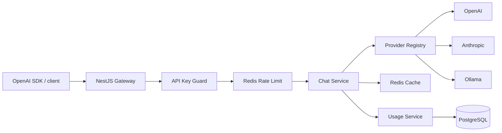

# LLM Gateway

[](https://github.com/sirdadfar/llm-gateway/actions/workflows/ci.yml) [فارسی](README.fa.md)

A self-hosted, production-minded **OpenAI-compatible LLM gateway** built with NestJS and TypeScript. One API in front of OpenAI, Anthropic Claude and local Ollama models.

## Features

- OpenAI-compatible `/v1/chat/completions` and `/v1/models`
- Prefix-based model routing plus simple aliases
- Claude, OpenAI and Ollama provider adapters
- Non-streaming and SSE streaming
- API keys stored as SHA-256 hashes; full key shown only at creation
- Redis request limiting and response caching
- PostgreSQL usage/audit records
- Admin key management and usage statistics
- Swagger at `/docs`, liveness/readiness checks
- Docker Compose, migrations, Jest and GitHub Actions
- Prompts and Authorization headers are not logged by default

## Quick start

1. `cp .env.example .env`
2. Put at least one provider key in `.env` (Ollama can run locally).
3. `docker compose up --build`

Create a client key:

```bash
curl -X POST http://localhost:3000/admin/api-keys \
  -H "Authorization: Bearer change-me" -H "Content-Type: application/json" \
  -d '{"name":"local-client","requestsPerMinute":60,"allowedModels":[]}'
```

Use the returned key once:

```bash
curl http://localhost:3000/v1/chat/completions \
  -H "Authorization: Bearer lgw_..." -H "Content-Type: application/json" \
  -d '{"model":"gpt-4o-mini","messages":[{"role":"user","content":"Hello"}],"temperature":0}'
```

Streaming:

```bash
curl http://localhost:3000/v1/chat/completions \
  -H "Authorization: Bearer lgw_..." -H "Content-Type: application/json" \
  -d '{"model":"ollama/llama3.2","messages":[{"role":"user","content":"Write one sentence."}],"stream":true}'
```

## Architecture



The provider boundary is deliberately small: request normalization happens before the provider adapter, and response/stream chunks are mapped back to OpenAI's public contract.

## Model routing

- `gpt-*`, `o1*`, `o3*`, `o4*` → OpenAI
- `claude-*` → Anthropic
- `ollama/<name>` → Ollama
- `fast` → OpenAI, `smart` → Anthropic

Provider availability is controlled by `ENABLED_PROVIDERS`.

## OpenAI SDK compatibility

Node:

```js
import OpenAI from 'openai';
const client = new OpenAI({apiKey: process.env.LGW_KEY, baseURL:'http://localhost:3000/v1'});
const answer = await client.chat.completions.create({model:'gpt-4o-mini',messages:[{role:'user',content:'Hello'}]});
console.log(answer.choices[0].message.content);
```

Python:

```python
from openai import OpenAI
client = OpenAI(api_key="lgw_...", base_url="http://localhost:3000/v1")
print(client.chat.completions.create(
    model="ollama/llama3.2",
    messages=[{"role":"user","content":"Hello"}],
).choices[0].message.content)
```

## Environment

| Variable | Purpose | Default |
|---|---|---|
| PORT | HTTP port | 3000 |
| DATABASE_URL | PostgreSQL URL | — |
| REDIS_URL | Redis URL | — |
| ADMIN_API_KEY | Admin bearer key | — |
| OPENAI_API_KEY | OpenAI credential | empty |
| ANTHROPIC_API_KEY | Anthropic credential | empty |
| OLLAMA_BASE_URL | Ollama endpoint | http://ollama:11434 |
| ENABLED_PROVIDERS | enabled adapters | openai,anthropic,ollama |
| REQUEST_TIMEOUT_MS | upstream timeout budget | 60000 |
| PROVIDER_RETRIES | retry budget | 1 |
| CACHE_ENABLED | response cache | true |
| CACHE_TTL_SECONDS | cache TTL | 300 |
| RATE_LIMIT_ENABLED | Redis limiting | true |
| DEFAULT_RPM | default key RPM | 60 |
| DEFAULT_MONTHLY_TOKEN_QUOTA | monthly quota; 0 disables | 0 |
| LOG_PROMPTS | opt-in prompt logging | false |

## API

- `POST /v1/chat/completions`
- `GET /v1/models`
- `GET /v1/usage`
- `POST /admin/api-keys`
- `GET /admin/api-keys`
- `DELETE /admin/api-keys/:id`
- `GET /admin/usage`
- `GET /health`
- `GET /health/ready`
- `GET /docs`

Cache is only used for non-streaming calls at temperature 0, or when `X-Cache: enable` is sent. `Cache-Control: no-cache` bypasses it. Cached responses are recorded with `cached=true`.

## Adding a provider

Implement `LLMProvider` with `chat`, `chatStream`, `listModels` and `healthCheck`. Add the class to `ProvidersModule`, then add its routing rule to `ProviderRegistry`. Keep provider-specific types inside that adapter; do not leak SDK objects into the chat service.

## Design decisions

**PostgreSQL** is the source of truth for credentials metadata and usage. **Redis** is deliberately ephemeral: rate-limit counters and cached completions can disappear without data loss.

The gateway uses a normalized internal request/result model instead of passing vendor SDK objects through controllers. This makes provider behavior testable and keeps the public API stable.

The current reference implementation favors a compact operational surface over a job queue. Usage writes are fire-and-forget with guarded failure handling, so telemetry cannot block a response.

## Development

```bash
npm ci
npm run migration:run
npm run start:dev
npm test
npm run lint
npm run build
```

## Trade-offs and roadmap

The next hardening steps are distributed Redis rate limiting with Lua, exact tokenizer accounting for providers without usage metadata, configurable retry/fallback policies, per-model cost tables, and a durable usage queue.

## License

MIT.