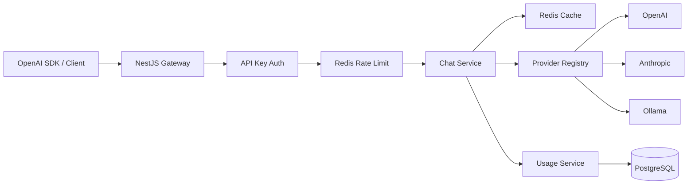

# LLM Gateway

[](https://github.com/sirdadfar/llm-gateway/actions/workflows/ci.yml) [](LICENSE) [فارسی](README.fa.md)

A self-hosted, production-minded OpenAI-compatible LLM gateway built with NestJS and TypeScript. One stable API contract in front of OpenAI, Anthropic Claude and local Ollama models.

## Highlights

- OpenAI-compatible chat completions and model discovery
- OpenAI SDK compatible Node.js and Python examples
- Configurable routing, aliases, retries, timeouts and optional fallback
- Non-streaming and SSE streaming with client disconnect cancellation
- API keys with lgw_ prefix; only SHA-256 hashes are stored
- Per-key model allowlists, Redis sliding-window rate limiting and monthly quota counters
- Redis response cache with deterministic canonical keys
- PostgreSQL usage/audit persistence and admin statistics
- Liveness/readiness checks, Swagger, Helmet, CORS and request-size limits
- TypeORM migrations, Docker Compose, Jest and GitHub Actions
- Prompts and authorization tokens are not logged by default

## Architecture



The public controllers do not talk directly to vendor SDKs. Requests are normalized into a small internal contract, provider adapters perform translation, and results are mapped back to the OpenAI public contract.

## Model routing

- gpt-* / o1* / o3* / o4* -> OpenAI
- claude-* -> Anthropic
- ollama/* -> Ollama
- fast -> gpt-4o-mini
- smart -> claude-sonnet-4-5

ENABLED_PROVIDERS is authoritative: a disabled provider cannot be selected by routing or fallback. Custom routes and aliases are supported through MODEL_ROUTES_JSON and MODEL_ALIASES_JSON.

## Reliability

Provider clients use configurable timeouts and retry budgets. Fallback is optional and only considered for upstream timeout/HTTP 5xx-style failures, not authentication, validation or policy errors.

Streaming requests propagate the client abort signal to the provider adapter. Redis cache failures fail open because caching is an optimization; rate-limit failures return 503 rather than silently bypassing a security policy.

## Security

Client secrets are generated as lgw_<random-secret>. The plaintext secret is returned once at creation time. PostgreSQL stores only SHA-256 and a short prefix.

Administrative endpoints use a separate ADMIN_API_KEY and compare it using a length-safe constant-time comparison. Do not commit credentials, prompts or generated secrets.

Per-key allowedModels can restrict access to an explicit model list. An empty list means all models exposed by enabled providers.

## Caching

Streams are never cached. Temperature 0 requests are cacheable by default; X-Cache: enable explicitly enables caching for other temperatures. Cache-Control: no-cache bypasses it.

Cache keys are SHA-256 hashes of recursively canonicalized request data, so object property order does not create duplicate entries. X-Cache is HIT for a cache hit and MISS for an eligible upstream response.

## Rate limits and quotas

Request limiting uses an atomic Redis Lua sliding window. Responses include X-RateLimit-Limit, X-RateLimit-Remaining and X-RateLimit-Reset; 429 responses also include Retry-After.

Monthly token counters are keyed by API key and UTC month. A quota of 0 disables the quota.

## API

| Method | Endpoint | Purpose |
|---|---|---|
| POST | /v1/chat/completions | Chat completion |
| GET | /v1/models | Models visible to the current key |
| GET | /v1/usage | Current key usage |
| POST | /admin/api-keys | Create client key |
| GET | /admin/api-keys | List client keys |
| DELETE | /admin/api-keys/:id | Revoke client key |
| GET | /admin/usage | Aggregated usage |
| GET | /health | Liveness |
| GET | /health/ready | Dependency readiness |
| GET | /docs | Swagger UI |

## Quick start

1. Copy .env.example to .env.
2. Configure at least one provider credential, or run Ollama locally.
3. Start the stack:

```bash
docker compose up --build
```

Create a client key:

```bash
curl -X POST http://localhost:3000/admin/api-keys \
  -H "Authorization: Bearer change-me" \
  -H "Content-Type: application/json" \
  -d '{"name":"local-client","requestsPerMinute":60,"monthlyTokenQuota":0,"allowedModels":[]}'
```

Use it:

```bash
curl http://localhost:3000/v1/chat/completions \
  -H "Authorization: Bearer lgw_..." \
  -H "Content-Type: application/json" \
  -d '{"model":"gpt-4o-mini","messages":[{"role":"user","content":"Hello"}],"temperature":0}'
```

## Environment

| Variable | Purpose | Default |
|---|---|---|
| PORT | HTTP port | 3000 |
| DATABASE_URL | PostgreSQL connection | required |
| REDIS_URL | Redis connection | required |
| ADMIN_API_KEY | Admin secret | required |
| OPENAI_API_KEY | OpenAI credential | empty |
| ANTHROPIC_API_KEY | Anthropic credential | empty |
| OLLAMA_BASE_URL | Ollama endpoint | http://ollama:11434 |
| ENABLED_PROVIDERS | Enabled adapters | all |
| REQUEST_TIMEOUT_MS | Provider timeout | 60000 |
| PROVIDER_RETRIES | SDK retry budget | 1 |
| CACHE_ENABLED | Response cache | true |
| CACHE_TTL_SECONDS | Cache TTL | 300 |
| RATE_LIMIT_ENABLED | Request limiting | true |
| DEFAULT_RPM | Default RPM | 60 |
| DEFAULT_MONTHLY_TOKEN_QUOTA | Default quota | 0 |
| FALLBACK_ENABLED | Fallback routing | false |
| FALLBACK_MODELS | Ordered fallback candidates | empty |
| MODEL_ROUTES_JSON | Routing rules | built-in |
| MODEL_ALIASES_JSON | Model aliases | built-in |
| LOG_PROMPTS | Prompt logging | false |

## Docker

The default Compose stack starts the gateway, PostgreSQL and Redis. Ollama is optional:

```bash
docker compose --profile ollama up --build
```

The application image runs as a non-root user. Set DB_RUN_MIGRATIONS=true when the container should apply TypeORM migrations at startup.

## Development

```bash
npm install
npm run migration:run
npm run start:dev
npm test
npm run lint
npm run format:check
npm run build
```

CI runs lint, tests, build and Docker image build with PostgreSQL and Redis services.

## Adding a provider

Implement LLMProvider with chat, chatStream, listModels and healthCheck. Keep vendor-specific types inside the adapter, register it in ProvidersModule, then add routing rules to ProviderRegistry.

## Production notes

PostgreSQL is the source of truth for key metadata and usage. Redis is ephemeral infrastructure for rate limiting, quotas and caching.

For production, terminate TLS at a trusted reverse proxy/load balancer, restrict CORS, replace the development admin secret, use managed PostgreSQL/Redis with backups and monitoring, and rotate provider credentials regularly.

Usage persistence is intentionally non-blocking. If telemetry storage is unavailable, the request path remains available; deployments requiring guaranteed telemetry should place a durable queue in front of the usage writer.

## License

MIT.